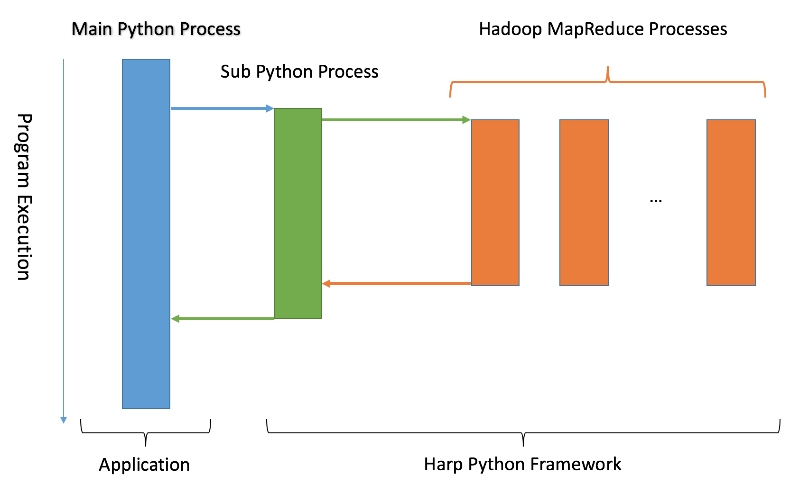
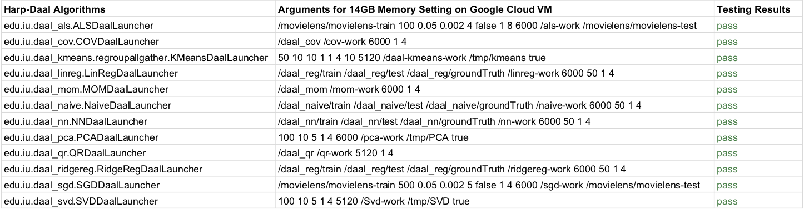

# Python Interface to Harp and Harp-Daal

## Introduction

This work provides a pure Python programming experience of using Harp with Hadoop. Python developers can 1) setup Harp applications from the Python side, 2) run Harp applications, and 3) print results or convert results to native Python variables. In this manual, we take KMeans as an example.

### API Usage:
1.	In order to run the KMeans application with customized arguments, import the KMeansApplication API from the Harp Python package “harp.applications”.
2.	Configure Hadoop, Harp, and arguments by calling some configuration funtions.
3.	Run the application within Python.
4.	Call print result function or conversion function to get the result. After the data conversion, the result variable can be used with any other Python packages, such as numpy or scipy.
5.	A full source code of the usage will be provided later.

### Process Communication Diagram:


## Installation

Installation is as easy as checking out the latest code from the stable branch of `harp`.

```bash
git clone https://github.com/DSC-SPIDAL/harp.git
```

### Dependencies
Please have all dependencies installed.

* Python 2.7+
* Python module Numpy (Install with your `pip`)
* Hadoop 2.6.0/Hadoop 2.6.5
* DAAL (Please see instructions under `harp-daal-app`)

### Environment Variables
After the code have been checked out and dependencies installed, please `export` all the following environment variables.

```
# Hadoop
export HADOOP_HOME=<path to hadoop home folder>

# Harp
export HARP_JAR=<path to>/harp-app-1.0-SNAPSHOT.jar
export HARP_DAAL_JAR=<path to>/harp-daal-app-1.0-SNAPSHOT.jar
export DAALROOT=<path to your compiled daal folder>
export PYTHONPATH=<path to>/harp-daal-python
```

## Example Code
Example code can be found under folder `examples`. For instance, to run KMeans with Harp-Daal, please run the following command:

```
cd harp-daal-python
python examples/daal/run_harp_daal_KMeansDaal.py
```

## Arguments and Testing Results


## Maintainance
Please raise issues in GitHub if you have any problems. Pull requests are very welcome.
