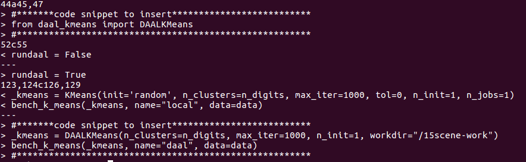

# Python part another version

## Invoke Harp-DAAL K-means via Python Interface 

Besides, the Java programming API, Harp-DAAL currently provides another Python API, which interfaces 
Harp-DAAL with other python written applications. By just adding several lines of python code, you 
are able to deploy the original python application on Hadoop Cluster and boost the performance by 
leveraging DAAL kernels. 

The python codes for image clustering is located at the path

```bash
${PYTHONPATH}/examples/scdemo/tutorial
```

### Step.1 Run Imageclustering on 15Scenery Dataset with Python Scikit-Learn K-means 

Run the pipeline from feature extraction, training, evaluation and finally check the clusters results.

```python
cd ${PYTHONPATH}/examples/scdemo/test
../tutorial/run_kmeans.sh
```


### Step.2 Modify to invokes Harp-DAAL

*demo_kmeans_local.py* is the original python codes of image clustering without Harp-DAAL. 
```python
# ############################################################################
# call kmeans module 
# ############################################################################
KMeans(init='random', n_clusters=n_digits, max_iter=1000, tol=0, n_init=1, n_jobs=1)
```
*demo_kmeans_daal.py* replaces the above K-means module by a Harp-DAAL invocation

```python
# ############################################################################
# call Harp-DAAL Kmeans module 
# ############################################################################
DAALKMeans(n_clusters=n_digits, max_iter=1000, n_init=1, workdir="/15scene-work")
```

View all the modifications by
```bash
diff ../tutorial/demo_kmeans_local.py ../tutorial/demo_kmeans_daal.py
```



### Step.3 Invokes Harp-DAAL

```bash
../tutorial/run_kmeans.sh daal
```

### Step.4 Check the results of clustering

Download the result files.

```bash

TODO: need BoFeng's input here.

```

### Step.5 (Optional)Tune Harp-DAAL-Kmeans Parameters

*daal_kmeans.py* contains the python API to Harp-DAAL-Kmeans Java codes. 
In the *__init__* function, tune the arguments (parameters) and compare the performance. 

```python
    def __init__(self, n_clusters=10, max_iter=10, init = 'random', n_init = 1,
            n_node = 1, n_thread = 8, n_mem = 10240, workdir = "/kmeans-work"
            ):
        """
        n_clusters  ; set number of clusters
        max_iter    ; set maximum iteration number
        n_node      ; set mapper number
        n_thread    ; set thread number in each mapper
        init        ; set the centroid initialization method, 'random' by default
        n_init      ; set the number of runs to select the best model, 1 by default
        """

```

* Increase iteration number *max_iter* to check the changes in results
* Increase the thread number *n_thread* to check the performance boost by multi-threading
* Increase the mapper number *n_node* to check benefits from node-level parallelism.


