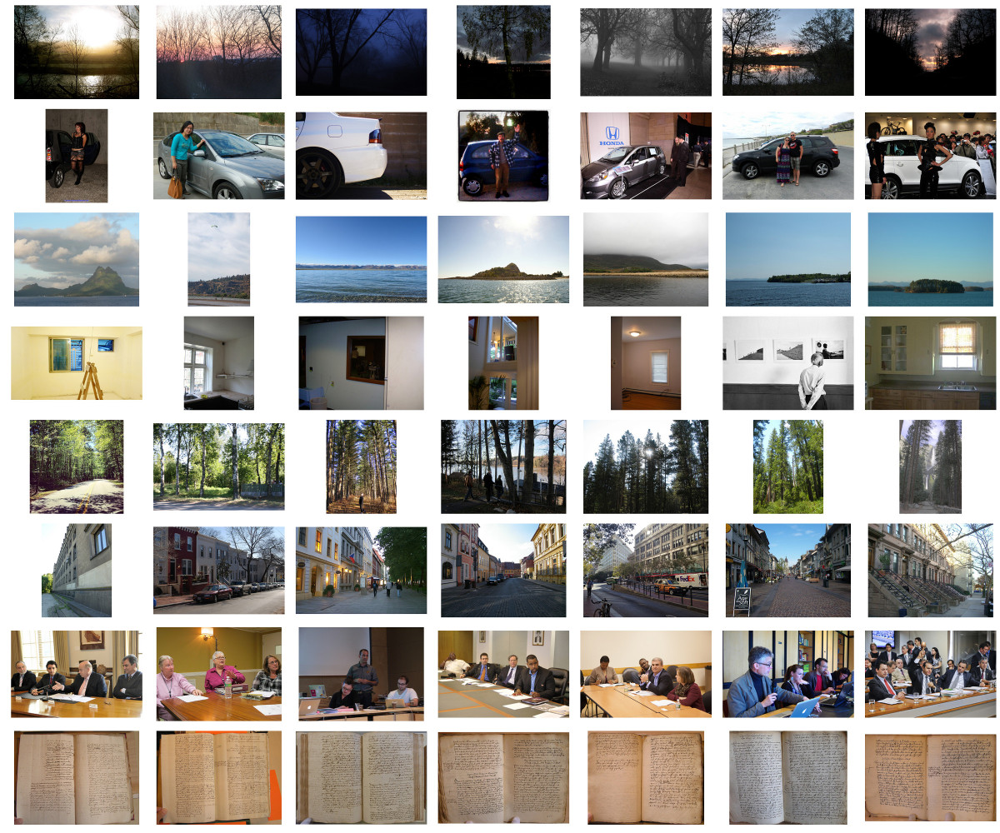

# Image Clustering on YFCC100M

In this tutorial, we demonstrate applying k-means clustering on the YFCC100M image dataset in the following steps. 

## Prerequsites

Install Harp and HarpDAAL according to the instructions: 
(Harp Installation)[https://dsc-spidal.github.io/harp/docs/getting-started-cluster/],
(HarpDAAL Installation)[https://dsc-spidal.github.io/harp/docs/harpdaal/harpdaal/]

Python Packages

Package | version
-----  | ------------
python |    2.7.12  | 
numpy  |    1.13.1  | Library for large, multi-dimensional arrays and matrices
scipy             |        0.19.1   | Python Scientific Computing Library
scikit-learn      |        0.19.0   | Machine Learning in Python
matplotlib        |        2.0.2    | Matplotlib: Python plotting
pillow            |        3.2.0    | Python Imaging Library

All these packages should be first installed properly. [Anaconda](https://anaconda.org/) is recommended distribution easy to use.

## Step 1. Prepare the Dataset

YFCC100M is compiled from the data available on Yahoo! Flickr, including 100 million images, each with 4096 dimensional deep features extracted by using VGG model trained on ImageNet . 

First, (Download the dataset) [https://multimediacommons.wordpress.com/yfcc100m-core-dataset/]

Secondly, extract the main index file “yfcc100m_dataset.bz2” and the features files under directory “features”. It is a large dataset that needs 1.5 T disk space.

## Step 2. Data Preprocessing

Data preprocessing including data format transformation, dimension reduction from 4096 to 128 by applying Principal Component Analysis (PCA). 

The whole dataset is about 100Mx4Kx8 = 3.2T Bytes in double precision, therefore you need a large enough cluster to run a distributed version of PCA, otherwise, train a pca model on a subset of samples is just ok.

```sh

#modify the YFCCDATA_DIR first

#set work dir 
mkdir -p test
cd test

#train a pca model, save to pca128-50samples.pkl
../scripts/run_trainpca.sh

#apply the trained pca model to the dataset
../scripts/run_transform.sh
```

## Step 3. Model training by k-means 

Copy all the transformed data to HDFS.

```sh
hadoop fs -mkdir -p /yfccfull/data
hadoop fs -put pca128/* /yfccfull/data
```

Run Harp-DAAL k-means on this data

```sh
#
# modify the settings first
# ITR(iteration number), Node(num of nodes), Thd(num of threads per node)
# Mem(memory allocated to each mapper in MB)
../scripts/run_kmeans.sh
```

## Step 4. Visualize the Cluster Results

Get the kmeans result, select some clusters and download sample images in them.

```sh
../scripts/run_drawcluster.sh
```

Finally, a pdf file, top10.pdf,  is created as a selected sample of the clusters.

In this tutorial, the clustering centroids is set to K=100000 that generates good clustering results. The high accuracy is due to that the YFCC100M dataset (of 100 million images is similar to ImageNet, and the deep features is extracted by VGG model trained with ImageNet, demonstrate their effectiveness. To show the effectiveness of the clustering result of k-means with deep features, sample images are drawn from each resulting cluster and tiled in rows. A selected 8 clusters are shown as below:




